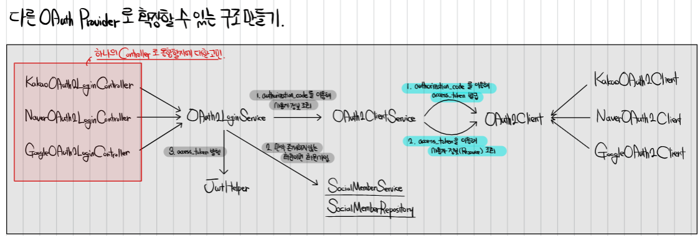

TODO List API 서버
===

# 📝 프로젝트 소개

- Spring Framework 기반으로 할 일 카드를 관리하는 REST API 서버입니다.
- JWT 인증과 OAuth 로그인을 지원합니다.
- 간단한 테스트 코드를 포함하고 있습니다.

<h2>목차</h2>

> - [📚 API 명세서](#API-명세서)
> - [☁️ ERD Cloud](#erd-cloud)
> - [📦 패키지 구조](#패키지-구조)
> - [🔄 통신 흐름](#통신-흐름)
> - [⚙️ 주요 기능](#주요-기능)
> - [🔐 JWT 인증](#jwt-인증)
> - [🔑 OAuth 로그인](#oauth-로그인)
> - [🧪 테스트 코드](#테스트-코드)
> - [💻 개발 환경](#개발-환경)

# [API 명세서](https://mobzz.notion.site/1c3b0b6d379f4d5aa93d4ebc058ecd12?v=3c5b824e364e4112b4865b03a336dd05&pvs=74)

<details><summary>Use case diagram</summary>


</details>

## 일부 요약


# [ERD Cloud](https://www.erdcloud.com/d/8JmKdknxC3JsBpzEe)

## 요약


# 패키지 구조

```
org.example.todolistserverchapter4
└── api.v1
    └── domain
        ├── todo
        │   ├── controller
        │   ├── dto
        │   ├── model
        │   ├── query
        │   ├── repository
        │   └── service
        ├── user
        │   ├── controller
        │   ├── dto
        │   ├── model
        │   ├── repository
        │   └── service
    ├── ApiV1MappingConfig
    └── exception
    └── infra.swagger
    └── util
└── security
```

- dto 패키지는 클라이언트-서버 API 통신에 필요한 데이터 전송 객체를 담고 있습니다.<br/>
- model 패키지는 DB와 매핑되는 Entity 객체를 담고 있습니다.<br/>
- controller 패키지는 클라이언트의 요청을 받아 처리하는 Rest API 컨트롤러를 담고 있습니다.
- repository 패키지는 DB와 직접적으로 통신하는 JpaRepository 인터페이스를 담고 있습니다.
- service 패키지는 비즈니스 로직을 처리하는 서비스 인터페이스와 구현체를 담고 있습니다.
- query 패키지는 Query parameter에 사용하는 enum을 담고 있습니다.
- exception 패키지는 예외 처리를 위한 커스텀 예외 클래스를 담고 있습니다.
- swagger 패키지는 Swagger 설정을 담고 있습니다.
- util 패키지는 유틸리티 클래스를 담고 있습니다.
- security 패키지는 Spring security에 관련된 클래스를 담고 있습니다.

## [/api/v1 package로 이동](src/main/kotlin/org/example/todolistserverchapter4/api/v1)

# 통신 흐름

DDD 설계에 의거해 작성되었습니다.

- **Controller**: 클라이언트의 요청을 받아 DTO로 변환하고 비즈니스 로직을 수행할 적절한 Service에 요청을 보냅니다.
- **Service**: 필요한 데이터를 Repository에 요청하여 가져와 비즈니스 로직을 처리하고 요청에 맞는 Dto를 반환합니다.
- **Repository**: DB와 통신해 Entity를 관리하며 Service의 요청에 맞는 데이터를 가져와 반환합니다.

다른 Aggregate에 대해서는 Repository는 참조하지 않고 service를 의존합니다.

```plaintext
     Client
       |
       v
+--------------+
|  Controller  |
+--------------+
       |
       v
+--------------+
|   Service    |
+--------------+
       |
       v
+--------------+
|  Repository  |
+--------------+
       |
       v
+--------------+
|   Database   |
+--------------+
```

# 주요 기능

- Todo 카드 생성, 조회, 수정, 삭제, 진행 상태 변경
- Todo 카드에 댓글 생성(익명 포함), 조회, 수정, 삭제
- 유저 생성, 프로필 조회, 프로필 수정, 삭제

<details><summary>Todo Controller 예시</summary>

```kotlin
@RestController
@RequestMapping("/todos")
class TodoController(
    private val todoService: TodoService
) : ApiV1MappingConfig() {

    @GetMapping
    fun getTodoList(
        @RequestParam(defaultValue = "created_at_asc") sort: TodoSort,
        @RequestParam(defaultValue = "0") page: Int,
        @RequestParam(defaultValue = "10") size: Int,
        @RequestParam(required = false) userIds: List<Long>? = null,
    ): ResponseEntity<Page<TodoDto>> {
        val pageable: Pageable = PageRequest.of(page, size, sort.convertToSort())

        return /*...*/
    }

    /*...*/

    @PostMapping
    fun createTodo(
        @Valid @RequestBody request: TodoCreateDto,
        @ModelAttribute("userId") userId: Long?
    ): ResponseEntity<TodoDto> {
        if (userId == null) {
            throw NotAuthorizedException()
        }

        return /*...*/
    }

    /*...*/
}
```

</details>
<br/>
<details><summary>Todo Service 예시</summary>

```kotlin
@Service
class TodoServiceImpl(
    val todoRepository: TodoRepository,
    val commentRepository: CommentRepository,

    val userService: UserService
) : TodoService {

    override fun getTodoList(userIds: List<Long>?, pageable: Pageable): Page<TodoDto> {
        val todos = if (userIds != null) {
            todoRepository.findByUserIdIn(userIds, pageable)
        } else {
            todoRepository.findAll(pageable)
        }

        val userDtos = todos.map { it.userId }.distinct().let { userService.getUserProfiles(it) }

        return todos.map { DtoConverter.convertToTodoDto(todo = it, userDto = userDtos[it.userId.toInt()]) }
    }

    /*...*/

    @Transactional
    override fun createTodo(userId: Long, request: TodoCreateDto): TodoDto {
        val todo = todoRepository.save(
            Todo.fromDto(
                request = request,
                userId = userId
            )
        )

        val userDto = userService.getUserProfile(todo.userId)

        return DtoConverter.convertToTodoDto(todo = todo, userDto = userDto)
    }

    /*...*/
}
```

</details>

<br/>

## Todo QueryDSL Repository 예시

```kotlin
@Repository
class TodoQueryDslRepository : QueryDslSupport() {

    private val todo = QTodo.todo
    private val comment = QComment.comment

    fun findWithComments(todoId: Long): Pair<Todo?, List<Comment>> {
        // querydsl 에서 지원하는 Tuple
        val result: List<Tuple> = queryFactory
            .select(todo, comment)
            .from(todo)
            .leftJoin(comment).on(todo.id.eq(comment.todo.id))
            .where(todo.id.eq(todoId))
            .fetch()

        val todo = result[0].get(todo)
        val comments = result.mapNotNull { it.get(comment) }

        return Pair(todo, comments)
    }
}
```

<br/>

<details><summary>Todo Entity 예시</summary>

```kotlin
@Entity
@Table(name = "todo")
@SQLRestriction("status != 'Deleted'")
@SQLDelete(sql = "UPDATE todo SET status = 'Deleted', deleted_at = NOW() WHERE id = ?")
class Todo(
    @Column(name = "title")
    var title: String,

    @Column(name = "description")
    var description: String? = null,

    @Enumerated(EnumType.STRING)
    @Column(name = "status")
    var status: TodoStatus = TodoStatus.Alive,

    @Enumerated(EnumType.STRING)
    @Column(name = "card_status")
    var cardStatus: TodoCardStatus = TodoCardStatus.NotStarted,

    @CreationTimestamp
    @Column(name = "created_at", updatable = false)
    val createdAt: LocalDateTime = LocalDateTime.now(),

    @UpdateTimestamp
    @Column(name = "updated_at")
    var updatedAt: LocalDateTime? = null,

    @Column(name = "deleted_at")
    var deletedAt: LocalDateTime? = null,

    @Column(name = "user_id")
    val userId: Long
) {
    @Id
    @GeneratedValue(strategy = GenerationType.IDENTITY)
    var id: Long? = null

    fun hasPermission(user: UserDto): Boolean {
        return UserRole.valueOf(user.role) == UserRole.Admin || this.userId == user.id
    }

    private fun validate() {
        require(title.isNotBlank()) { "Title cannot be blank" }
        require(title.length <= 100) { "Title must be 100 characters or less" }
        require(this.description != null && this.description!!.length <= 1000) { "Description must be 1000 characters or less" }
    }

    companion object {
        fun fromDto(request: TodoCreateDto, userId: Long): Todo {
            return Todo(
                title = request.title,
                description = request.description,
                userId = userId
            ).apply { this.validate() }
        }
    }
}
```

</details>

# JWT 인증

#### 이 프로젝트는 JWT 인증을 지원합니다. 사용자가 로그인하면 서버는 JWT 토큰을 생성하여 사용자에게 반환합니다.

#### 사용자는 이 토큰을 사용하여 인증이 필요한 API를 호출할 수 있습니다.

#### Spring security에서 JWT 인증을 사용하고 있으며, 토큰은 서버에서 발급하고 검증합니다.

#### 토큰은 클라이언트의 요청 헤더에 포함되어 있어야 합니다.

<details><summary>Jwt plugin 예시</summary>

```kotlin
@Component
class JwtPlugin(
    @Value("\${auth.jwt.issuer}") private val issuer: String,
    @Value("\${auth.jwt.secret}") private val secret: String,
    @Value("\${auth.jwt.accessTokenExpirationHour}") private val accessTokenExpirationHour: Long,
) {

    fun validateToken(jwt: String): Result<Jws<Claims>> {
        return kotlin.runCatching {
            val key = Keys.hmacShaKeyFor(secret.toByteArray(StandardCharsets.UTF_8))
            Jwts.parser().verifyWith(key).build().parseSignedClaims(jwt)
        }
    }

    fun generateAccessToken(subject: String, role: String): String {
        return generateToken(subject, role, Duration.ofHours(accessTokenExpirationHour))
    }

    private fun generateToken(subject: String, role: String, expirationPeriod: Duration): String {
        val claims: Claims = Jwts.claims().add(mapOf("role" to role)).build()

        val now = Instant.now()
        val key = Keys.hmacShaKeyFor(secret.toByteArray(StandardCharsets.UTF_8))

        return Jwts.builder()
            .subject(subject)
            .issuer(issuer)
            .issuedAt(Date.from(now))
            .expiration(Date.from(now.plus(expirationPeriod)))
            .claims(claims)
            .signWith(key)
            .compact()
    }
}
```

</details>

<details><summary>Jwt Authentication Filter 예시</summary>

```kotlin
@Component
class JwtAuthenticationFilter(
    private val jwtPlugin: JwtPlugin
) : OncePerRequestFilter() {

    companion object {
        private val BEARER_PATTERN = Regex("^Bearer (.+?)$")
    }

    override fun doFilterInternal(
        request: HttpServletRequest,
        response: HttpServletResponse,
        filterChain: FilterChain
    ) {
        val jwt = request.getBearerToken()

        if (jwt != null) {
            jwtPlugin.validateToken(jwt)
                .onSuccess {
                    val userId = it.payload.subject.toLong()
                    val role = it.payload.get("role", String::class.java)

                    val principal = UserPrincipal(
                        id = userId,
                        roles = setOf(role)
                    )

                    val authentication = JwtAuthenticationToken(
                        principal = principal,
                        details = WebAuthenticationDetailsSource().buildDetails(request)
                    )

                    SecurityContextHolder.getContext().authentication = authentication
                }
        }

        filterChain.doFilter(request, response)
    }

    private fun HttpServletRequest.getBearerToken(): String? {
        val headerValue = this.getHeader(HttpHeaders.AUTHORIZATION) ?: return null
        return BEARER_PATTERN.find(headerValue)?.groupValues?.get(1)
    }
}
```

</details>

### [Jwt Package로 이동](src/main/kotlin/org/example/todolistserverchapter4/api/v1/infra/security/jwt)

### [Security config으로 이동](src/main/kotlin/org/example/todolistserverchapter4/api/v1/infra/security/SecurityConfig.kt)

### [Security util로 이동](src/main/kotlin/org/example/todolistserverchapter4/api/v1/infra/security/SecurityUtils.kt)

# OAuth 로그인

#### 이 프로젝트는 OAuth 로그인을 지원합니다. 현재 카카오, 네이버를 통한 로그인을 지원하고 있습니다.

#### 챌린지반 강의에서 배운 아래 구조를 참고했습니다.



<details><summary>OAuth2 Service / Client 예시</summary>

```kotlin
@Service
class OAuth2ClientService(
    private val clients: List<OAuth2Client>
) {
    fun redirectUrlBy(provider: OAuth2Provider): String {
        val client = this.selectClient(provider)
        return client.redirectUrl()
    }

    fun login(provider: OAuth2Provider, authorizationCode: String): OAuth2UserInfo {
        val client = this.selectClient(provider)
        return client.getAccessToken(authorizationCode)
            .let { client.getUserInfo(it) }
    }

    private fun selectClient(provider: OAuth2Provider): OAuth2Client {
        return clients.find { it.supports(provider) } ?: throw NotSupportedException("지원하지 않는 OAuth Provider 입니다.")
    }
}

@Component
class KakaoOAuth2Client(
    @Value("\${kakao.client.id}") val clientId: String,
    @Value("\${kakao.redirect.url}") val redirectUrl: String,
    @Value("\${kakao.api.auth_url}") val authUrl: String,
    @Value("\${kakao.api.token_url}") val tokenUrl: String,
    @Value("\${kakao.api.profile_url}") val userUrl: String,
    private val restClient: RestClient
) : OAuth2Client {

    override fun redirectUrl(): String {
        return StringBuilder(authUrl)
            .append("?client_id=").append(clientId)
            .append("&redirect_uri=").append(redirectUrl)
            .append("&response_type=").append("code")
            .toString()
    }

    override fun getAccessToken(code: String): String {
        val requestData = mutableMapOf(
            "grant_type" to "authorization_code",
            "client_id" to clientId,
            "code" to code
        )

        return restClient.post()
            .uri(tokenUrl)
            .contentType(MediaType.APPLICATION_FORM_URLENCODED)
            .body(LinkedMultiValueMap<String, String>().apply { this.setAll(requestData) })
            .retrieve()
            .onStatus(HttpStatusCode::isError) { _, _ ->
                throw RuntimeException("카카오 AccessToken 조회 실패")
            }
            .body<KakaoTokenResponse>()
            ?.accessToken
            ?: throw RuntimeException("카카오 AccessToken 조회 실패")
    }

    override fun getUserInfo(accessToken: String): OAuth2UserInfo {
        return restClient.get()
            .uri(userUrl)
            .header("Authorization", "Bearer $accessToken")
            .retrieve()
            .onStatus(HttpStatusCode::isError) { _, _ ->
                throw RuntimeException("카카오 UserInfo 조회 실패")
            }
            .body<KakaoUserInfoResponse>()
            ?: throw RuntimeException("카카오 UserInfo 조회 실패")
    }

    override fun supports(provider: OAuth2Provider): Boolean {
        return provider == OAuth2Provider.Kakao
    }
}
```

</details>

### [oauth Package로 이동](src/main/kotlin/org/example/todolistserverchapter4/api/v1/oauth)

# 테스트 코드

#### 이 프로젝트는 간단한 테스트 코드를 포함하고 있습니다.

#### Entity - Service - Controller 에 각각 해당하는 Unit 테스트가 존재합니다.

<details><summary>User Entity Test 예시</summary>

```kotlin
class UserTest : BehaviorSpec({
    Given("회원 가입 정보 Dto가 주어졌을 때") {
        val signUpDto = SignUpDto(
            email = "test@example.com",
            password = "password",
            nickname = "nickname"
        )

        When("User의 fromDto 메서드로 User를 생성하면") {
            val user = User.fromDto(signUpDto)

            Then("생성된 Entity의 정보는 회원가입 정보와 같아야 한다") {
                user.email shouldBe signUpDto.email
                user.password shouldBe signUpDto.password
                user.profile.nickname shouldBe signUpDto.nickname
            }
        }

        When("User의 프로필을 업데이트하면") {
            val user = User.fromDto(signUpDto)
            val testProfile = Profile(nickname = "newName")

            user.updateProfile(testProfile)

            Then("User의 프로필은 업데이트된 프로필과 같아야 한다") {
                user.profile shouldBe testProfile
            }
        }

        When("User 프로필 내용중 닉네임을 빈칸으로 업데이트하려고 하면") {
            val user = User.fromDto(signUpDto)
            val testProfile = Profile(nickname = "")

            Then("닉네임 길이 불변성 검증에서 예외가 발생해야 한다") {
                shouldThrow<IllegalArgumentException> {
                    user.updateProfile(testProfile)
                }
            }
        }
    }
})
```

</details>

### [User entity test로 이동](src/test/kotlin/org/example/todolistserverchapter4/domain/user/model/UserTest.kt)

### [Todo service test로 이동](src/test/kotlin/org/example/todolistserverchapter4/domain/todo/service/TodoServiceTest.kt)

### [Comment controller test로 이동](src/test/kotlin/org/example/todolistserverchapter4/domain/comment/controller/CommentControllerTest.kt)

# 개발 환경

- 개발 언어: Kotlin 1.9.23, JDK 21
- IDE: IntelliJ IDEA 2024.1
- Build tool: Gradle
- 프레임워크: Spring Boot 3.2.5, Spring Security 5.6.0, QueryDSL 5.0.0
- 라이브러리: Springdoc 2.5.0, jjwt 0.12.5
- 테스트 라이브러리: Kotest 5.5.5, Mockk 1.13.8
- 데이터베이스: PostgresQL 14.1 with Supabase