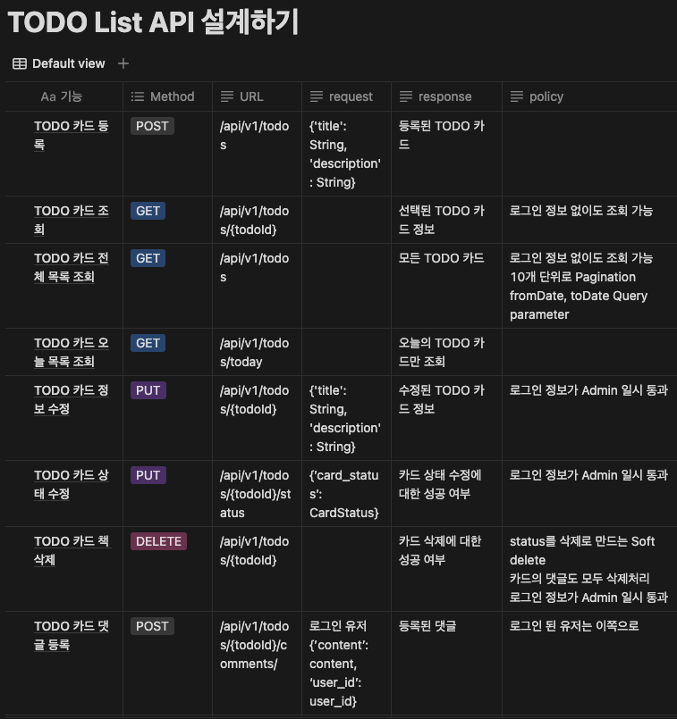
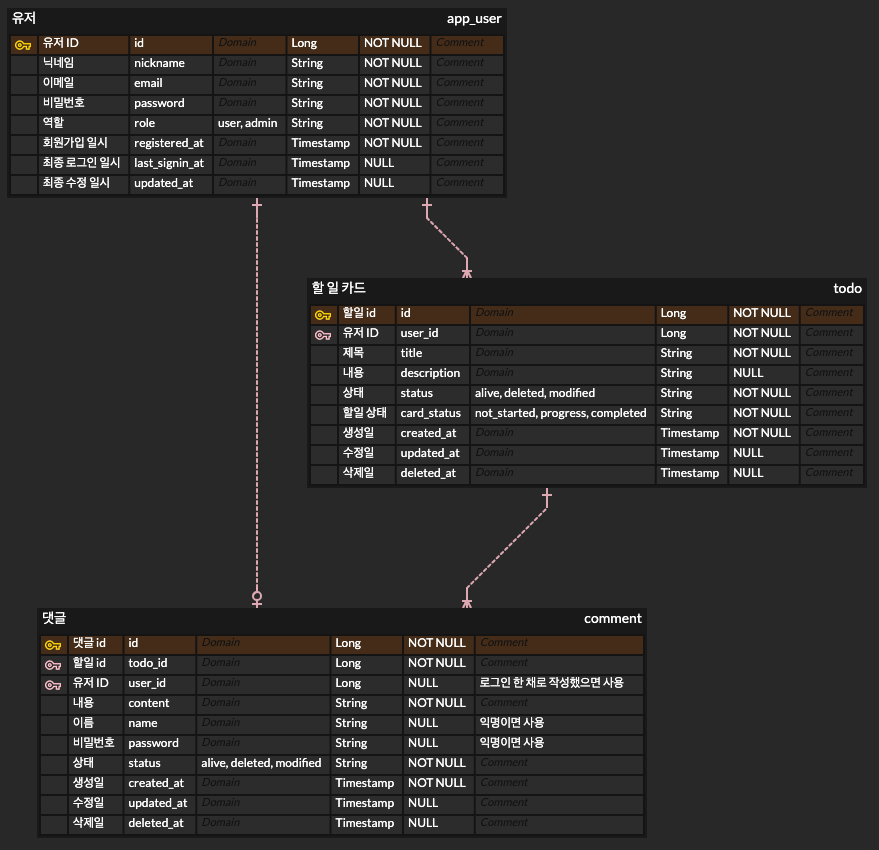

TODO List API 서버
===
# 📝 프로젝트 소개 
- Spring Framework 기반으로 할 일 카드를 관리하는 REST API 서버입니다.

<h2>목차</h2>

> - [📚 API 명세서](#API-명세서)
> - [☁️ ERD Cloud](#erd-cloud)
> - [📦 패키지 구조](#패키지-구조)
> - [🔄 통신 흐름](#통신-흐름)
> - [⚙️ 주요 기능](#주요-기능)
> - [💻 개발 환경](#개발-환경)


# [API 명세서](https://mobzz.notion.site/1c3b0b6d379f4d5aa93d4ebc058ecd12?v=3c5b824e364e4112b4865b03a336dd05&pvs=74)

<details><summary>Use case diagram</summary>


</details>

## 일부 요약



# [ERD Cloud](https://www.erdcloud.com/d/8JmKdknxC3JsBpzEe)

## 요약




# 패키지 구조

```
todolistserverchapter3
├── api
    └── v1
        ├── domain
        │   ├── comment
        │   │   ├── dto
        │   │   ├── model
        │   │   ├── controller
        │   │   ├── repository
        │   │   └── service
        │   ├── todo
        │   │   ├── dto
        │   │   ├── model
        │   │   ├── controller
        │   │   ├── repository
        │   │   └── service
        │   └── user
        │       ├── dto
        │       ├── model
        │       ├── controller
        │       ├── repository
        │       └── service
        ├── exception
        └── infra
```

- dto 패키지는 클라이언트-서버 API 통신에 필요한 데이터 전송 객체를 담고 있습니다.<br/>
- model 패키지는 DB와 매핑되는 Entity 객체를 담고 있습니다.<br/>
- controller 패키지는 클라이언트의 요청을 받아 처리하는 Rest API 컨트롤러를 담고 있습니다.
- repository 패키지는 DB와 직접적으로 통신하는 JpaRepository 인터페이스를 담고 있습니다.
- service 패키지는 비즈니스 로직을 처리하는 서비스 인터페이스와 구현체를 담고 있습니다.

## [/api/v1 package로 이동](src/main/kotlin/org/example/todolistserverchapter3/api/v1)

# 통신 흐름

DDD 설계에 의거해 작성되었습니다.

- **Controller**: 클라이언트의 요청을 받아 DTO로 변환하고 비즈니스 로직을 수행할 적절한 Service에 요청을 보냅니다.
- **Service**: 필요한 데이터를 Repository에 요청하여 가져와 비즈니스 로직을 처리하고 요청에 맞는 Dto를 반환합니다.
- **Repository**: DB와 통신해 Entity를 관리하며 Service의 요청에 맞는 데이터를 가져와 반환합니다.

```plaintext
     Client
       |
       v
+--------------+
|  Controller  |
+--------------+
       |
       v
+--------------+
|   Service    |
+--------------+
       |
       v
+--------------+
|  Repository  |
+--------------+
       |
       v
+--------------+
|   Database   |
+--------------+
```

# 주요 기능

- Todo 카드 생성, 조회, 수정, 삭제, 진행 상태 변경
- Todo 카드에 댓글 생성(익명 포함), 조회, 수정, 삭제
- 유저 생성, 프로필 조회, 프로필 수정, 삭제

<details><summary>Todo Controller 예시</summary>

```kotlin
@RestController
@RequestMapping("/todos")
class TodoController(
    private val todoService: TodoService
) : ApiV1MappingConfig() {

    @GetMapping
    fun getTodoList(@RequestParam(defaultValue = "created_at_asc") sort: TodoSort): ResponseEntity<List<TodoDto>> {
        return ResponseEntity.status(HttpStatus.OK).body(todoService.getTodoList(sort))
    }

    /*...*/

    @PostMapping
    fun createTodo(@RequestBody request: TodoCreateDto): ResponseEntity<TodoDto> {
        return ResponseEntity.status(HttpStatus.CREATED).body(todoService.createTodo(request))
    }

    /*...*/
}
```
</details>
<br/>
<details><summary>Todo Service 예시</summary>

```kotlin
@Service
class TodoServiceImpl(
    val todoRepository: TodoRepository,
    val userRepository: UserRepository,
) : TodoService {
    override fun getTodoList(sort: TodoSort): List<TodoDto> {
        val todos = todoRepository.findAll(
            Sort.by(
                when (sort) {
                    TodoSort.CreatedAtDesc -> Sort.Direction.DESC
                    TodoSort.CreatedAtAsc -> Sort.Direction.ASC
                },
                "created_at"
            )
        )

        return todos.map { it.toDto() }
    }
    
    /*...*/

    @Transactional
    override fun createTodo(request: TodoCreateDto): TodoDto {
        val user = userRepository.findByIdOrNull(request.userId) ?: throw ModelNotFoundException(
            "User not found",
            request.userId
        )
        return todoRepository.save(
            Todo(
                title = request.title,
                description = request.description,
                user = user
            )
        ).toDto()
    }
    
    /*...*/
}
```
</details>

<br/>

<details><summary>Todo Entity 예시</summary>

```kotlin
@Entity
@Table(name = "todo")
@SQLRestriction("status != 'Deleted'")
@SQLDelete(sql = "UPDATE todo SET status = 'Deleted', deleted_at = NOW() WHERE id = ?")
class Todo(
    /*...*/
    @Enumerated(EnumType.STRING)
    @Column(name = "card_status")
    var cardStatus: TodoCardStatus = TodoCardStatus.NotStarted,

    @CreationTimestamp
    @Column(name = "created_at", updatable = false)
    val createdAt: LocalDateTime = LocalDateTime.now(),

    @UpdateTimestamp
    @Column(name = "updated_at")
    var updatedAt: LocalDateTime? = null,

    @Column(name = "deleted_at")
    var deletedAt: LocalDateTime? = null,

    @ManyToOne(fetch = FetchType.EAGER)
    @JoinColumn(name = "user_id")
    val user: User
) 

/*...*/
```
</details>

# 개발 환경

- 개발 언어: Kotlin 1.9.23, JDK 21
- IDE: IntelliJ IDEA 2024.1
- Build tool: Gradle
- 프레임워크: Spring Boot 3.2.5
- 라이브러리: Springdoc 2.5.0
- 데이터베이스: PostgresQL 14.1 with Supabase